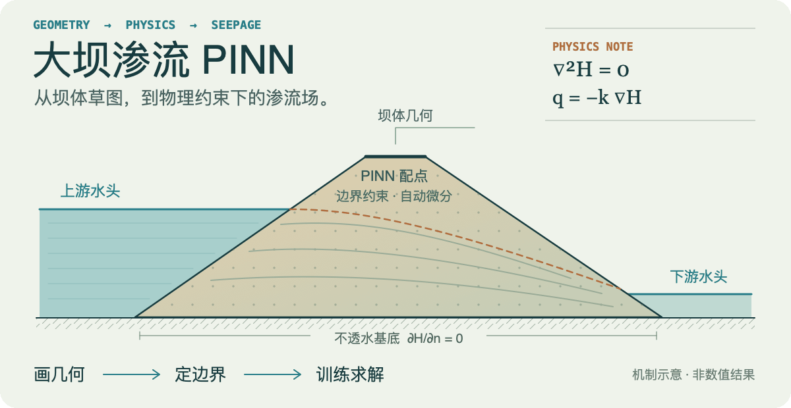
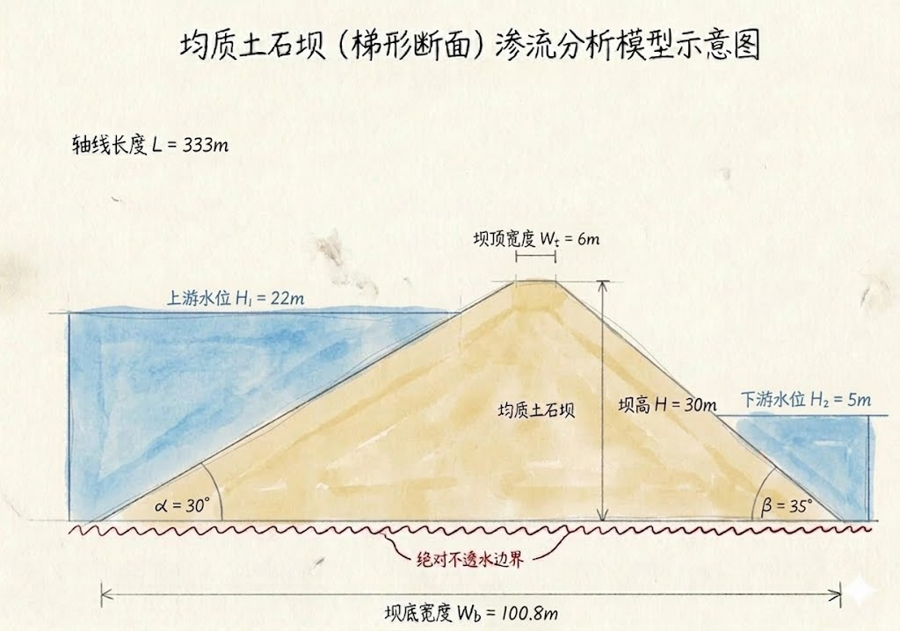
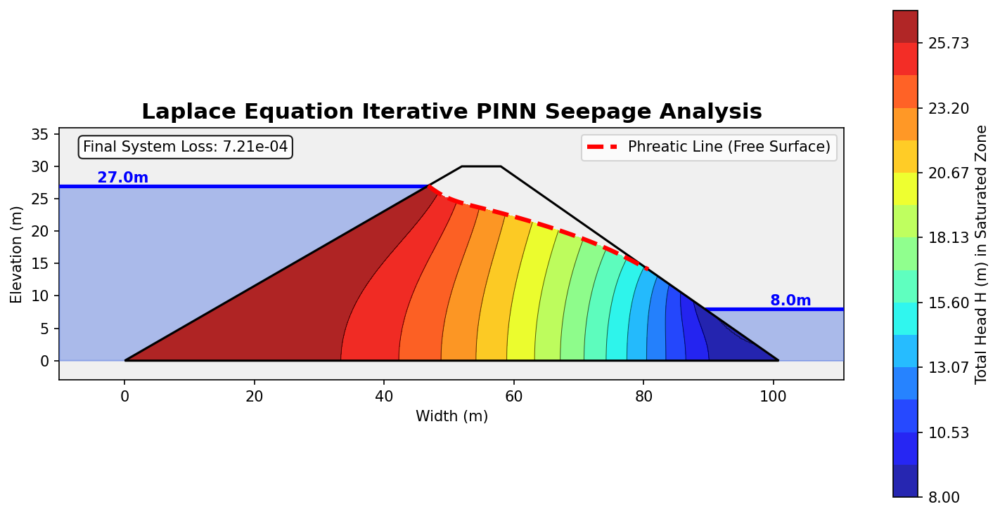

<p align="center">
  
</p>

# 基于多智能体与 PINN 的大坝渗流自动求解系统

基于物理信息神经网络 (PINN) 的大坝渗流场自动求解 Web 应用，支持交互绘图和草图智能识别两种输入模式。

## 仓库中的示例材料

<details>
<summary>查看输入草图与已保存的结果图</summary>

**输入草图示例：上游 22 m、下游 5 m。**



**另一算例的已保存输出：上游 27 m、下游 8 m。**



两张图来自不同算例，不构成一次配对实验。本次 README 更新没有重新训练或验证这些数值结果。

</details>

## 使用流程

1. **定义几何**：在画布中绘制，或通过草图识别提取几何信息。
2. **设置物理问题**：检查几何与边界信息，进入 PINN 求解。
3. **查看结果**：等待训练并查看渗流场可视化。

头图展示的是坝体剖面与渗流路径示意，具体结果由输入条件与训练过程决定。

## 环境要求

| 依赖 | 最低版本 |
|------|---------|
| Python | 3.10+ |
| Node.js | 18+ |
| npm | 9+ |

> Python 和 Node.js 缺一不可。没有请先安装。

## 快速启动

### macOS / Linux

```bash
cd webapp
bash start.sh
```

### Windows

```bat
cd webapp
start.bat
```

或直接双击 `webapp\start.bat`。

脚本会自动创建虚拟环境、安装依赖、启动前后端，并打开浏览器。

## 手动启动（如果脚本不可用）

### 1. 后端

```bash
cd webapp/backend
python -m venv .venv

# macOS / Linux
source .venv/bin/activate
# Windows
.venv\Scripts\activate

pip install -r requirements.txt
python -m uvicorn main:app --host 0.0.0.0 --port 8000 --reload
```

### 2. 前端（新开一个终端）

```bash
cd webapp/frontend
npm install
npm run dev
```

### 3. 打开浏览器

访问 http://localhost:5173

## 草图识别功能（可选）

草图识别需要 Gemini API Key。启动后在「草图识别」模式下会弹窗要求输入。

如需使用独立脚本：

```bash
export GEMINI_API_KEY="your-key-here"
cd Dam_Seepage_LLM_PINN
python main.py
```

## 项目结构

```
├── Dam_Seepage_LLM_PINN/    # PINN 求解核心 + 多智能体
│   ├── src/pinn/             # 模型、损失函数、训练
│   ├── src/agents/           # 视觉 Agent + 物理校验 Agent
│   └── src/utils/            # 可视化工具
├── webapp/
│   ├── backend/              # FastAPI 后端
│   ├── frontend/             # React + Vite 前端
│   ├── start.sh              # macOS/Linux 启动脚本
│   └── start.bat             # Windows 启动脚本
└── README.md
```

## 常见问题

**Q: `pip install torch` 很慢怎么办？**
A: 使用清华镜像源：
```bash
pip install -r requirements.txt -i https://pypi.tuna.tsinghua.edu.cn/simple
```

**Q: 端口被占用？**
A: 修改 `start.sh` / `start.bat` 中的 `BACKEND_PORT` 和 `FRONTEND_PORT`。

**Q: 没有 GPU 能用吗？**
A: 可以，系统会自动使用 CPU 训练，只是速度较慢。

<details>
<summary>Static overview</summary>

[Open the static SVG](./assets/readme/hero.svg).

</details>
